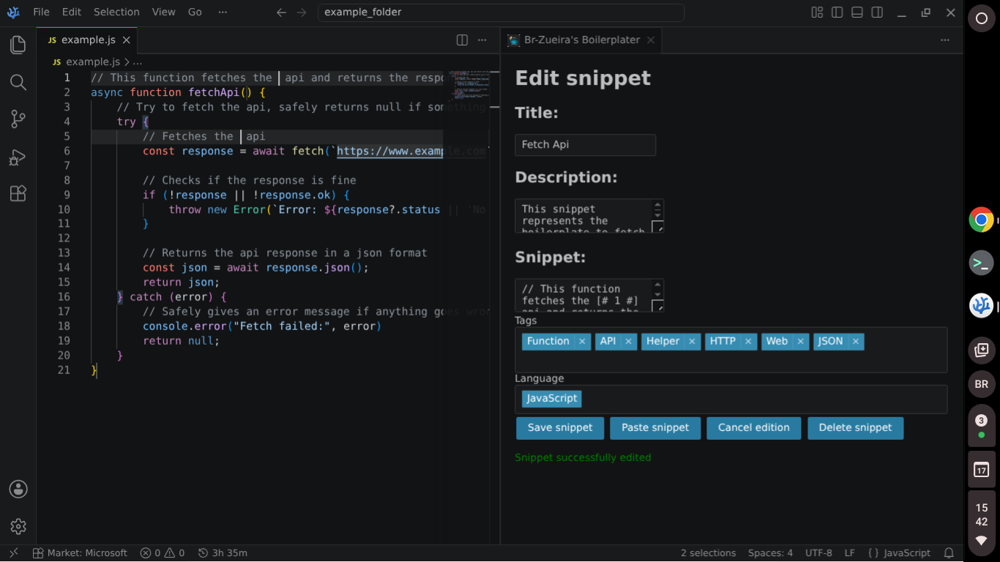

# Br-Zueira's Boilerplater

An extension that allows saving code snippets for later use in a simple and intuitive way. From a dev, to devs.

## Features

* **Saving snippets** by highlighting them and pressing ctrl+u (mac: cmd+u).
* **Snippet organizing** by language, tags, title and description.
* **Webview** to add, read, create or remove snippets, languages or tags.
* **Easy use of the snippets:** Going to the webview, searching a snippet and pressing "paste snippet" pastes it directly into your cursor position. No more jumping through old projects or searching into internet to copy boilerplate.
* **Template language** for snippets: [% %] for macros and [# #] for tabstops (more info at extensions settings).
* **100% local and self contained,** so no external dependencies or connections needed.

## How it Works (Under the Hood)

Boilerplater uses an isolated virtual database instance that commits directly to a local `boilerplater.db` sqlite file in your extension context to keep things simple, local and lightweight. For macros and tabstops, it uses a custom templater function which searches for templates with regex, evaluates macros as JavaScript to take full proveit of JS potential and converts tabstops into standard Vscode tabstop syntax, escaping '$' dolar signs in the process, which avoids Vscode engine of evaluating syntax such as JavaScript's ${value}, PHP's $value or even plain text monetary values as tabstops.

## Requirements

Vscode/Vscodium or similar (duh)
Download bundled version (vsix): None
Compile it locally: npm >= 10
To compile locally, you can run `npm install` to get dev dependencies and then either `npm run compile` to compile once, `npm run watch` to compile at every change or `npm run package` to compile once and bundle as vsix

## Extension Settings

### Shortcuts

* Ctrl + u (Mac: cmd+u) => Save snippet from highlight
* Ctrl + alt + u (Mac: cmd+alt+u) => Access webview

### Macros

Expressions to be evaluated either by other macros or by the [% %] template evaluator. They can be:

#### Default

Those are predefined by extension and always return a string. Always evaluated first.
These are the default macros and example values:

* **BP_FILENAME:** 'script'
* **BP_FILENAME_EXT:** 'script.lang'
* **BP_EXT:** '.lang'
* **BP_DIRECTORY_NAME:** '/home/user/vscode/my-project'
* **BP_WORKSPACE_NAME:** 'my-project'

* **BP_YEAR:** '1970'
* **BP_MONTH:** '01'
* **BP_DAY:** '01'

* **BP_SELECTED_TEXT:** 'print("I'm selected inside document!")'
* **BP_CLIPBOARD:** 'print("I'm at clipboard!")'

#### Custom

Defined in the macros manager. Can be imported with snippet template syntax [% %] and its value can be accessed by the macros that come after it (defined by evaluation order). Its value is defined by a JavaScript expression, can return anything, and must return something. Macros can be asynchronous, expect if you want to execute then inside the [% %] template evaluator, which is totally synchronous. Although it is sandboxed, it can access vscode, path, extension context and other macros. Their titles must be valid variable names.

## Known Issues

* The search bar in list view may "glitch" a little bit (this would be misplaced cursor or missing chars) every time a search is sent, specially if you type too fast.
* While trying to paste a snippet, sometimes the cursor will unfocus from document before it can be pasted, making it fail. Simply refocus cursor at document, then try again while cursor is still focused at document.

## Credits/Acknowledgements

* **SQL.js:** Made the local database completely lightweight and self contained
* **Tom-Select:** Made the snippet manager dropdowns possible
* **Esbuild:** Made compiled extension way more lightweight
* **StarDance:** The inspiration for this project and the only reason it exists